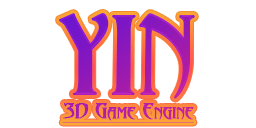
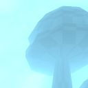
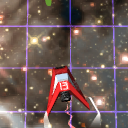
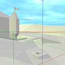
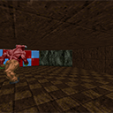

Yin is a 3D game engine, being developed by 
[Mark "hogsy" Sowden](https://hogsy.me/), 
for game jams and prototyping.

**It is not currently ready for production use!** 
And is available here with absolutely no support whatsoever. 
You're welcome to email me for help, just don't expect any.

The philosophy behind this engine would probably be considered
[NIH syndrome](https://en.wikipedia.org/wiki/Not_invented_here),
as the engine avoids many third-party libraries to ensure a lightweight 
design (despite not necessarily being the more optimal approach).

But *why*? 
It's a bit much for me to get into in a readme, but I've provided a few points below.

- It's educational! And _sometimes_ fun!
- It _hopefully_ encourages innovation
- Lightweight design ensures components of the engine can be radically shifted or redesigned to suit your needs
- With direct control over every component of the software, we're not at the mercy of someone else

That all being said, **Yin is not recommended for use in your own projects**, 
as this is not intended as a professional grade engine but instead just 
something that's easy to throw things at and modify. It's also worth
adding that it's being developed primarily for **fun**, hence why you're not necessarily
going to receive any support from me.

## Games

Below is a list of released games that have used this engine.

- [Space Ranger: Asteroid Attack](https://hogsy.itch.io/space-ranger-asteroid-attack)
- [Buddy's Adventure](https://hogsy.itch.io/buddy)

## Screenshots

## Features

- Integration with [Hei Platform Library](https://github.com/OldTimes-Software/hei)
  - Plugins for supporting additional package and texture formats
  - PNG, TGA, JPG, BMP and GIF image support
  - Abstract graphics interface with support for different graphics APIs via plugins
  - GLSL pre-processor with support for directives such as `include`
  - Virtual file-system allowing for directories and packages to be mounted at runtime
- Console interface, with auto-completion, commands and variables
- Flexible material system providing support for outlining multiple passes, blend modes and more
- Custom package format with compression
- Custom image format called `GFX` with own "block" compression and support for DXTC
- Simple post-processing pipeline with support for FXAA and bloom
- Supersampling up to 2x display resolution
- Memory manager with garbage collection and usage tracking
- Node format for serialisation/deserialisation; can be stored as either binary or text
- Qt-based editor frontend

## Roadmap

### v3.0.0/Luna (When It's Ready™)

- [ ] Entity component system (**70%**)
- [ ] Collisions (**5%**)
- [ ] Editor frontend (**20%**)
- [ ] Skeletal animation (**1%**)

## License

Unless noted otherwise, the code for Yin is under LGPLv3.

